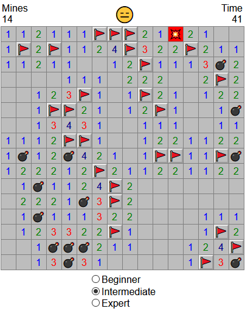

I'm back!

# React Minesweeper

## Summary

A implementation of the game minesweeper using react with a focus on learning and experimentation: react hooks, prototypes, the strategy pattern, constructor reference equality, and mutation.

I've found that I enjoy this style of programming much more then the traditional react class-based, immutable style for complex projects like games. I like explicitly seperating the view from the model, and something about recreating large nested data structures, like 2D Arrays, doesn't sit right with me. Irregardless, I found that I could quickly add new features, even as the project grew larger. The zen of python comes to mind; "simple is better then complex, complex is better then complicated". 

If I did the project again, I would consider moving the game logic from the tiles to the game state. Additionally, I would try to put more state exclusive data on the game state objects, as opposed to putting it on the game object itself.

## Todos

* Add statistics
* Add custom difficulties
* Add live link

## Further Inspiration
* Battle Royale Minesweeper using websockets
* Attempt a similar programming style